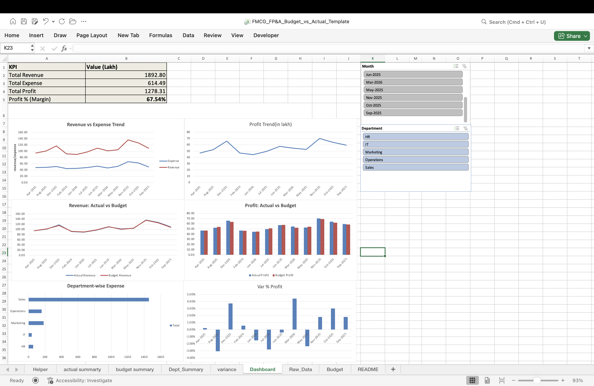

# FMCG FP&A Dashboard (Excel) — Budget vs Actual

## Overview
This project is an FP&A dashboard in Excel for an FMCG-style dataset to track monthly performance and compare Budget vs Actual results.

## Key Features
- KPIs: Revenue, Expense, Profit, Profit % (Margin)
- Revenue vs Expense trend and Profit trend
- Budget vs Actual (Revenue and Profit)
- Variance analysis (₹ and %)
- Department-wise expense view
- Slicers: Month, Department

## Tools/Skills
Excel PivotTables, Charts, Slicers, GETPIVOTDATA

## How to use
1. Open the Excel file
2. Use slicers to filter Month/Department
3. Review KPIs and charts

## Screenshots

![Budget vs Actual(budget_vs_ actual.png)
